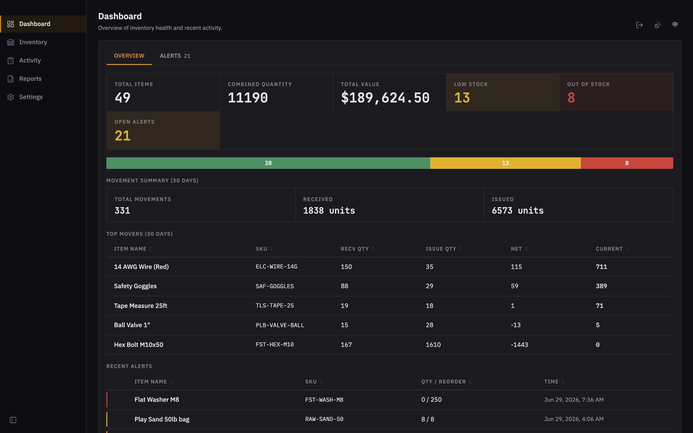

<div align="center">

# OpenInventory

**Free, local-first inventory & material-issue tracking for small teams.**

Track stock, issue materials with a full audit trail, catch low stock before it bites,
and let anyone look up an item from their phone over your LAN — all backed by a single
local SQLite file. No server, no accounts, no subscription.

[](https://github.com/josephmqiu/OpenInventory/releases)
[](https://github.com/josephmqiu/OpenInventory/releases)
[](LICENSE)

[**Download**](#download) · [Features](#features) · [Mobile lookup](#scan-and-look-up-from-any-phone) · [Documentation](#documentation) · [Contributing](#contributing)



</div>

---

## Features

### Issue & receive materials with a full audit trail

Every stock movement records who, what, when, and why. Issue against a worker and a
reason; on-hand quantities and low-stock alerts update the moment you submit.


### Batch issue in a single transaction

Select multiple items, drop quantities into the Issue Cart, and commit them together —
one operator, one reason, one atomic write.


### Find anything, instantly

Search by name, SKU, or location; filter by stock status; sort and reorder columns.
The table stays fast with thousands of movements behind it.


### Executive period reports

Month / quarter / half / year summaries with movement value, prior-period and
year-over-year deltas, a six-period trend, biggest movers, and CSV / print-to-PDF export.


### Scan and look up from any phone

Turn on the built-in LAN server and every item gets a QR label. Scan it from any phone
or tablet on the same network for a read-only lookup — current stock, location, reorder
level, and price — with no app install and no login.

<p align="center">
  
</p>

### And everything else

- **Item pricing** — optional per-item unit price with an app-wide currency (CNY / USD / EUR / GBP)
- **Low-stock alerts** — raised automatically when quantities drop below reorder levels
- **Personnel management** — track who performs each stock movement
- **Configurable columns** — show/hide, resize, and reorder inventory and activity-log columns; layout persists per machine
- **QR labels** — generate and export labeled QR codes for quick item lookup
- **Backup** — scheduled and on-demand SQLite backups
- **Bilingual** — English and Simplified Chinese (zh-CN)
- **Dark / Light / Auto themes** — industrial design with an amber accent

## Download

Grab the latest build from [**GitHub Releases**](https://github.com/josephmqiu/OpenInventory/releases):

| Platform | Format | Auto-update |
|----------|--------|-------------|
| Windows x64 | NSIS installer | ✅ |
| Linux x64 | AppImage | ✅ |
| macOS arm64 | dmg / zip | Manual download |

Everything runs on your machine — data lives in a local SQLite file (e.g.
`~/Library/Application Support/inventory-monitor/data/` on macOS). Windows and the Linux
AppImage update in place; the macOS build currently ships **unsigned** as a manual
download (no auto-update yet — code signing is on the roadmap).

<br>

---

<div align="center">

### 🛠️ For developers

Everything below covers building, testing, and contributing to OpenInventory.

</div>

---

## Tech Stack

| Layer | Technology |
|-------|-----------|
| Desktop shell | Electron 41, electron-vite |
| Backend (main process) | TypeScript, Effect TS, better-sqlite3 |
| Frontend (renderer) | React 19, Vite, custom CSS |
| Database | SQLite (local file, zero config) |
| IPC | Electron contextBridge with typed channels |
| LAN server | Node.js HTTP with access key auth |
| Tests | Vitest (unit/integration), Playwright (E2E) |

## Getting Started

```bash
# Install dependencies
npm install

# Start in development mode
npm run dev
```

The app opens an Electron window. The first `npm run dev` rebuilds native modules
for Electron (cached on subsequent runs). Data is stored in
`~/Library/Application Support/inventory-monitor/data/` (macOS).

For browser-only development, `npm run dev:preview` runs the full admin UI
against a local unauthenticated API on `.dev-data`. That preview server is a
development tool only. The packaged production LAN server does not serve the
admin browser app; it exposes QR item lookup plus authenticated read APIs.

## Scripts

| Script | Description |
|--------|-------------|
| `npm run dev` | Start Electron app in dev mode with HMR |
| `npm run build` | Production build (main + preload + renderer) |
| `npm run test` | Full Vitest unit/integration suite (renderer + backend) |
| `npm run test:backend` | Backend service + integration tests only |
| `npm run test:coverage` | Full Vitest coverage report (frontend + backend) |
| `npm run test:e2e` | Electron E2E workflow (builds app, runs Playwright) |
| `npm run verify` | Lint + full Vitest suite |
| `npm run verify:push` | Local pre-push gate: lint, Vitest, full E2E |
| `npm run verify:release` | Full release gate: lint, Vitest, coverage, full E2E |
| `npm run lint` | ESLint |
| `npm run pack` | Package app (unpacked, cleans dist/ first) |
| `npm run dist` | Package app for distribution (cleans dist/ first) |

Native module rebuilds are cached — repeated `dev`/`dist` runs skip the rebuild
if nothing changed (Electron version, platform, or lockfile).

## Project Structure

```
src/
  main/               # Electron main process
    services/          #   Effect TS service layer (DatabaseService, etc.)
    infrastructure/    #   SQLite schema, migrations, LAN server
    ipc/               #   IPC handler registration
  preload/             # contextBridge preload script
  renderer/src/        # React frontend
    app/               #   App shell, state hook, i18n, routing
    domain/            #   Business logic, TypeScript models
    services/          #   Gateway abstraction (IPC or HTTP)
    ui/components/     #   React components (panels, tables, modals)
test/                  # Backend test suite
e2e/                   # Playwright E2E tests
```

## Testing

```bash
npm run verify         # Lint + renderer/backend Vitest suite
npm run test:coverage  # Combined Vitest coverage report under coverage/
npm run test:e2e       # E2E workflow against a real Electron instance
npm run verify:push    # Same gate enforced by the Git pre-push hook
```

The E2E suite launches the app with an isolated temporary database and covers the most important product journeys: inventory lifecycle, LAN access, production QR lookup, backup, theme/language, and stock workflows.
Retries are treated as failures by default so flaky tests have to be fixed instead of silently passing.

## CI Policy

GitHub CI on pull requests and pushes to `master` runs only the fast lint + Vitest gate (`npm run verify`) to conserve build minutes. The full test suite, coverage, E2E matrix, packaging smoke tests, and release publishing run from the release workflow on version tags. The full test suite can also be run manually from GitHub Actions with the `Test Suite` workflow.

## Documentation

- [`docs/inventory-app-architecture.md`](docs/inventory-app-architecture.md) — system architecture (processes, services, IPC, schema, LAN server)
- [`docs/production-operations.md`](docs/production-operations.md) — release rule, Windows signing risk acceptance, restore-drill checklist
- [`docs/production-hardening-todo.md`](docs/production-hardening-todo.md) — production hardening tracker
- [`CHANGELOG.md`](CHANGELOG.md) — release history
- [`TODOS.md`](TODOS.md) — deferred work
- [`DESIGN.md`](DESIGN.md) — design system

## Design

The app follows an industrial/utilitarian design system documented in `DESIGN.md`. Key choices:

- IBM Plex Sans + JetBrains Mono typography
- Amber accent (not the usual SaaS blue)
- Max 4px border radius
- Dark-first with warm light theme option

## Contributing

Contributions are welcome. See [`CONTRIBUTING.md`](CONTRIBUTING.md) for dev setup, the
native-module build notes, and the test gate. Please also read the
[`CODE_OF_CONDUCT.md`](CODE_OF_CONDUCT.md). To report a security issue, follow
[`SECURITY.md`](SECURITY.md) (private disclosure, not a public issue).

## License

[MIT](LICENSE) © josephmqiu
