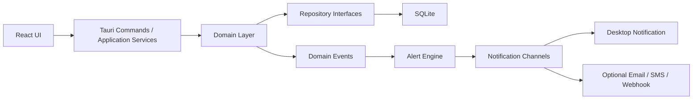

# Local Inventory App Plan

## 1. Product Goal

Build a local-first desktop inventory management application that allows users to:

- create inventory records
- view current inventory levels
- add stock into inventory
- take stock out of inventory
- perform stock count adjustments
- create and track refill orders
- record each inventory purchase in a refill order table
- receive low-stock alerts
- review movement history and audit records

The application runs offline on a local machine and stores data locally.

## 2. Target Platforms

The application supports:

- Windows 10 and 11
- macOS
- Linux desktop distributions with the required system webview libraries installed

## 3. Framework And Tools

Use this stack:

- Desktop shell: **Tauri 2**
- Frontend framework: **React 19**
- Frontend language: **TypeScript**
- Backend and business logic: **Rust**
- Local database: **SQLite**
- Frontend build tool: **Vite**
- Unit testing: **Vitest**
- UI and component testing: **React Testing Library**
- End-to-end testing: **Playwright**
- Desktop alerts: **Tauri Notification Plugin**

## 4. Architecture

Use **Clean Architecture** with clear boundaries between UI, application logic, domain rules, and infrastructure.

### Layers

1. **Presentation Layer**
   - React screens, forms, tables, dialogs, filters, and charts
   - displays current inventory levels
   - sends typed commands to the backend
   - does not execute SQL directly

2. **Application Layer**
   - use cases and command handlers
   - create item
   - receive stock
   - issue material
   - adjust count
   - create refill order
   - receive refill order
   - acknowledge alert
   - resolve alert
   - export data
   - back up data
   - restore data

3. **Domain Layer**
   - entities
   - value objects
   - policies
   - rules for stock movement, thresholds, refill orders, and auditability

4. **Infrastructure Layer**
   - SQLite repositories
   - notification adapters
   - backup and restore services
   - export services
   - logging
   - configuration
   - localization resources

## 5. Design Patterns

Use these patterns:

- **Repository Pattern**
  - abstracts access to items, movements, refill orders, alerts, users, suppliers, and settings

- **Unit of Work**
  - wraps stock changes, refill-order receipt posting, and alert creation inside one transaction

- **Command Handler Pattern**
  - handles all write operations
  - examples:
    - `CreateInventoryItem`
    - `ReceiveStock`
    - `IssueMaterial`
    - `AdjustInventoryCount`
    - `CreateRefillOrder`
    - `ReceiveRefillOrder`
    - `AcknowledgeLowStockAlert`

- **Query Service Pattern**
  - powers dashboards, tables, reports, and item detail views

- **Domain Events**
  - emits inventory level change events after stock mutations
  - triggers low-stock evaluation

- **Strategy Pattern**
  - supports multiple notification channels
  - examples:
    - desktop toast
    - email
    - SMS
    - webhook

## 6. High-Level Component Model



## 7. Functional Requirements

The application shall support:

- Create inventory records
- Edit inventory records
- Archive inventory records
- View current inventory levels
- Receive stock into inventory
- Issue stock out of inventory
- Perform stock count adjustments
- Track item movement history
- Show low-stock and out-of-stock items
- Trigger low-stock alerts
- Create and track refill orders
- Record each inventory purchase in a refill order table
- Acknowledge and resolve alerts
- Search inventory by SKU, name, category, barcode, and location
- Filter inventory by stock status, category, location, archive state, supplier, and refill-order status
- Export inventory data and reports
- Back up and restore the local database
- Save backups to a user-defined storage location
- Support backup destinations on local disk, local LAN shared folders, and cloud-synced folders
- Run manual and scheduled backups
- Maintain an audit log for all stock-changing actions
- Support Chinese language in the user interface

## 8. UI Requirements

The UI shall display current inventory levels prominently and continuously.

### Main Screens

- Dashboard
- Inventory List
- Item Detail
- Add Item
- Receive Stock
- Issue Material
- Stock Count / Adjustment
- Refill Orders
- Alerts Center
- Reports
- Settings

### Dashboard

The dashboard shall display:

- total inventory items
- total stock units
- low-stock item count
- out-of-stock item count
- recent stock receipts
- recent stock issues
- open alert count
- pending refill order count

### Inventory List

The inventory list shall be the primary working view and shall display current inventory levels in a table with these columns:

- SKU
- item name
- category
- location
- current quantity
- unit of measure
- minimum stock level
- reorder level
- stock status
- last updated timestamp

The inventory list shall support:

- global search
- sorting by each visible column
- filters for low stock, out of stock, category, location, supplier, and archived items
- row actions for receive, issue, adjust, and view history

### Item Detail

The item detail screen shall display:

- current quantity
- minimum stock level
- reorder level
- status badge
- movement history
- alert history
- adjustment history
- refill order history
- supplier and barcode information if available

### Refill Orders

The refill orders screen shall display a purchase table with these columns:

- refill order number
- supplier
- order date
- expected delivery date
- received date
- status
- total amount
- created by

The refill orders screen shall support:

- create refill order
- edit refill order before receipt
- mark refill order as received
- link received quantities to stock receipt movements
- filter by supplier, status, and date range

### Alerts Center

The alerts center shall display:

- all open low-stock alerts
- acknowledged alerts
- resolved alerts
- triggered time
- current quantity
- threshold level
- item reference
- acknowledgment state

### Settings

The settings screen shall include:

- application language
- backup destination path
- backup schedule
- backup retention settings
- test backup destination action
- backup now action
- restore from backup action
- last backup result
- alert settings
- user and role settings

### Usability Rules

The design shall:

- keep the inventory table central to the workflow
- use a left sidebar for main navigation
- use a top summary bar for live metrics
- keep forms short and direct
- use keyboard-friendly workflows
- show current quantity before stock-out confirmation
- show resulting quantity before confirming stock-out or adjustment
- use high-contrast status badges
- use text labels with color, never color alone
- keep alert count visible in the header
- use pagination or virtualization for large inventories
- support English and Simplified Chinese UI text
- keep labels, tables, forms, alerts, and reports translatable through an internationalization layer

## 9. Robust Feature Set

A robust and user-friendly inventory management tool requires the following capabilities.

### Inventory Master Data

- item creation
- item editing
- item archiving
- SKU or item code
- barcode or QR code field
- item name
- description
- category
- storage location
- supplier
- unit of measure
- minimum stock level
- reorder level
- cost per unit
- status

### Stock Operations

- receive stock
- issue stock
- manual adjustment
- stock count reconciliation
- transfer between internal locations
- movement notes
- reference numbers
- operator identity

### Refill Order Management

- refill order creation
- supplier-linked purchase records
- order status tracking
- expected delivery date tracking
- received date tracking
- line-item quantity and unit cost tracking
- purchase history by item and supplier
- receipt linkage between purchase and stock-in transaction

### Visibility And Monitoring

- current inventory quantity display
- low-stock list
- out-of-stock list
- movement history
- item history timeline
- dashboard summaries
- searchable tables

### Alerts

- low-stock detection
- alert acknowledgment
- alert resolution
- duplicate alert suppression
- desktop notifications
- optional escalation channels

### Reporting

- current stock report
- low-stock report
- out-of-stock report
- movement history report
- adjustment variance report
- inventory valuation report when cost tracking is enabled
- refill order report
- purchase history report by supplier and item

### Operations Support

- CSV export
- Excel-compatible export
- PDF summary export
- backup
- restore
- user-defined backup destination
- LAN backup target support
- cloud-synced folder backup support
- backup schedule management
- backup history and status view
- audit review
- settings management

### Advanced Extensions

- user login
- role-based permissions
- barcode scanner integration
- label printing
- supplier tracking
- purchase request generation
- multi-location inventory

## 10. Domain Model

### `InventoryItem`

- `id`
- `sku`
- `barcode`
- `name`
- `description`
- `category`
- `location_id`
- `supplier_id`
- `unit_of_measure`
- `min_quantity`
- `reorder_quantity`
- `current_quantity`
- `cost_per_unit`
- `status`
- `created_at`
- `updated_at`

### `InventoryMovement`

- `id`
- `item_id`
- `movement_type`
- `quantity`
- `previous_quantity`
- `new_quantity`
- `reason`
- `reference_no`
- `notes`
- `performed_by`
- `performed_at`

### `RefillOrder`

- `id`
- `order_no`
- `supplier_id`
- `order_date`
- `expected_delivery_date`
- `received_date`
- `status`
- `total_amount`
- `notes`
- `created_by`
- `created_at`
- `updated_at`

### `RefillOrderLine`

- `id`
- `refill_order_id`
- `item_id`
- `ordered_quantity`
- `received_quantity`
- `unit_cost`
- `line_total`

### `LowStockAlert`

- `id`
- `item_id`
- `threshold_quantity`
- `quantity_at_trigger`
- `status`
- `triggered_at`
- `acknowledged_by`
- `acknowledged_at`
- `resolved_at`
- `channel_summary`

### `Location`

- `id`
- `name`
- `code`

### `User`

- `id`
- `username`
- `display_name`
- `role`
- `status`

### `AppSetting`

- `key`
- `value`

## 11. Database Design

Use these tables:

- `inventory_items`
- `inventory_movements`
- `low_stock_alerts`
- `refill_orders`
- `refill_order_lines`
- `locations`
- `users`
- `app_settings`
- `audit_logs`
- `suppliers`
- `outbox_notifications`

### Database Rules

- enable `PRAGMA foreign_keys = ON` for each SQLite connection
- execute every stock mutation inside a transaction
- execute refill-order receipt posting inside the same transaction that updates inventory quantities
- use indexes on:
  - `inventory_items.sku`
  - `inventory_items.name`
  - `inventory_items.current_quantity`
  - `inventory_movements.item_id, performed_at`
  - `low_stock_alerts.item_id, status`
  - `refill_orders.order_no`
  - `refill_orders.supplier_id, order_date`
  - `refill_order_lines.refill_order_id, item_id`

### Quantity Storage

Store both:

- an immutable movement ledger in `inventory_movements`
- the latest quantity snapshot in `inventory_items.current_quantity`

This structure supports:

- fast inventory table rendering
- full audit history
- simple report generation
- reconciliation if needed

## 12. Business Rules

The system shall enforce:

- receive quantity must be greater than zero
- issue quantity must be greater than zero
- adjustment input must be valid numeric data
- every quantity change shall create a movement record
- current quantity shall not go negative unless an explicit override policy is enabled
- item archive shall not delete movement history
- low-stock alert shall open when current quantity becomes less than or equal to minimum stock level
- low-stock alert shall stay open while quantity remains less than or equal to minimum stock level
- low-stock alert shall resolve when quantity becomes greater than minimum stock level
- duplicate open low-stock alerts for the same item shall not exist
- each refill order shall have at least one line item
- each received refill-order line shall post a linked stock receipt movement
- refill-order status shall move through draft, ordered, partially received, received, or cancelled

## 13. Application Flows

### Create Item

1. User enters item details and threshold values.
2. System validates SKU uniqueness.
3. System saves the item record.
4. If an opening quantity is entered, the system creates an initial movement record and updates current quantity.

### Receive Stock

1. User selects an item and enters a positive quantity.
2. System validates the input.
3. System starts a transaction.
4. System inserts a stock receipt movement.
5. System updates current quantity.
6. System evaluates low-stock alert resolution.
7. System commits the transaction.

### Issue Material

1. User selects an item and enters a positive quantity.
2. System shows current quantity and resulting quantity.
3. System validates that negative stock is not created unless override is enabled.
4. System starts a transaction.
5. System inserts an issue movement.
6. System updates current quantity.
7. System evaluates low-stock alert creation.
8. System commits the transaction.
9. System sends a desktop alert if a new low-stock alert was created.

### Adjust Count

1. User selects an item and enters the counted quantity or adjustment value.
2. System requires a reason.
3. System records the adjustment movement.
4. System updates current quantity.
5. System evaluates alert state.

### Refill Order

1. User creates a refill order and selects a supplier.
2. User adds one or more inventory items as line items.
3. System stores ordered quantity, unit cost, and expected delivery date.
4. When stock arrives, the user marks the order as fully or partially received.
5. System posts linked stock receipt movements for the received quantities.
6. System updates inventory quantities inside the same transaction.
7. System updates refill-order status and receipt history.

## 14. Alerting Design

Alerting shall work in:

- desktop notifications
- in-app alerts center
- dashboard low-stock widget

### Alert Flow

1. A stock mutation changes an item quantity.
2. The application emits an inventory level changed event.
3. The alert evaluator checks the item against the threshold.
4. If quantity is less than or equal to minimum level and no open alert exists, the system creates an open alert.
5. The notification dispatcher sends a desktop notification.
6. If quantity becomes greater than minimum level, the system resolves the alert.

### Notification Channels

Use these channel types:

- `DesktopToastChannel`
- `EmailChannel`
- `SmsChannel`
- `WebhookChannel`

The first implementation uses desktop notifications. The other channels remain available as extension points in the architecture.

## 15. Reporting

The application shall provide:

- current stock report
- low-stock report
- out-of-stock report
- movement history by item
- movement history by date range
- adjustment variance report
- inventory valuation report when cost data is tracked
- refill order report
- purchase history report by supplier and item

Export formats:

- CSV
- Excel-compatible CSV layout
- PDF summary

## 16. Security, Reliability, And Performance

### Security

The application shall include:

- user login when multiple operators use the machine
- roles:
  - admin
  - inventory clerk
  - viewer
- permission checks for stock-changing actions

### Reliability

The application shall include:

- audit logging for all stock-changing actions
- automatic local backups
- backup restore flow
- user-defined backup destination settings
- backup support for local disk, LAN shared folders, and cloud-synced folders
- backup validation before accepting a target location
- failure logging for backup jobs
- input validation on every form
- transactional writes
- foreign key enforcement
- item archiving instead of destructive deletion
- failure logging for notification delivery

### Backup And Storage Plan

The application shall use this backup design:

- primary working data remains in the local SQLite database on the application machine
- backup destination is configurable by the user in Settings
- backup destination may be a local folder, a mapped network drive, a UNC LAN path, or a cloud-synced folder such as OneDrive, Dropbox, or Google Drive desktop sync
- the application writes backup files in a portable format that can be restored on another supported machine
- the application supports manual backup on demand
- the application supports scheduled automatic backup
- the application shows last successful backup time, next scheduled backup time, backup status, and target path
- the application validates that the selected backup location is writable before saving it
- the application creates backups using a temporary file and final rename so incomplete files are not treated as valid backups
- the application keeps backup history records with success and failure status
- the application supports retention rules for daily and weekly backups
- the restore flow allows the user to select a backup file from any supported location

### Performance

The application shall:

- open quickly on desktop
- load inventory tables quickly
- support at least tens of thousands of inventory rows in SQLite
- keep dashboard metrics responsive
- use indexed queries for SKU, name, status, movement history, and refill-order lookups

## 17. Localization Requirements

The application shall support:

- English
- Simplified Chinese

The localization design shall include:

- a centralized internationalization layer for all UI text
- translatable labels for navigation, forms, tables, buttons, dialogs, alerts, and reports
- support for Chinese text in inventory item names, descriptions, categories, locations, supplier names, and notes
- UTF-8 storage and retrieval across the full application stack
- Chinese-capable font selection in the UI
- date, time, and number formatting that can be localized per language setting
- a user setting to switch application language without changing stored inventory data
- validation and layout testing for longer Chinese labels in tables, forms, and dialogs

## 18. Suggested Project Structure

```text
src/
  ui/
    screens/
    components/
    forms/
    hooks/
    routes/
  application/
    commands/
    queries/
    dto/
  domain/
    entities/
    value_objects/
    policies/
    services/
    events/
  infrastructure/
    db/
    repositories/
    notifications/
    backup/
    export/
    i18n/
    logging/
src-tauri/
  src/
    commands/
    application/
    domain/
    infrastructure/
```

## 19. Implementation Plan

1. Define the SQLite schema for items, movements, refill orders, refill order lines, alerts, users, locations, suppliers, settings, and audit logs.
2. Implement domain rules for receive, issue, adjust, threshold checks, refill-order lifecycle, and alert lifecycle.
3. Implement internationalization support for English and Simplified Chinese.
4. Implement application commands and query services.
5. Build the inventory list UI with current inventory level display as the primary screen.
6. Build add-item, receive-stock, issue-material, and refill-order workflows.
7. Build dashboard summaries, alerts center, and refill order table.
8. Build low-stock desktop notification flow.
9. Build reports and export functions.
10. Build configurable backup and restore workflow for local folders, LAN shared folders, and cloud-synced folders.
11. Build user login and role handling.
12. Test all mutation, alert, reporting, refill-order, restore, backup-target, and localization scenarios.
13. Package the application for Windows, macOS, and Linux.

## 20. Final Design Direction

The product centers on one operating principle:

- the user sees current inventory levels immediately
- the user changes stock in one direct workflow
- the user gets a clear alert when inventory reaches a low level
- the user can always inspect who changed stock, when it changed, and why it changed
- the user can inspect every purchase through the refill order table and related receipt history

## Sources

- Tauri 2 overview: https://v2.tauri.app/
- Tauri project setup: https://v2.tauri.app/start/
- Tauri notification plugin: https://v2.tauri.app/plugin/notification/
- React 19 stable release: https://react.dev/blog/2024/12/05/react-19
- React 19.2 release: https://react.dev/blog/2025/10/01/react-19-2
- Vite guide: https://vite.dev/guide/
- Vitest guide: https://vitest.dev/guide/index.html
- Playwright intro: https://playwright.dev/docs/intro
- SQLite home page: https://www.sqlite.org/
- SQLite foreign keys: https://sqlite.org/foreignkeys.html
